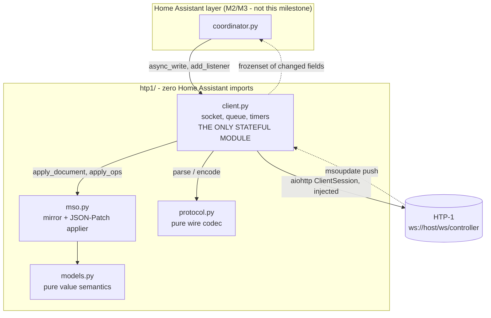

# System Design & Architecture — `htp1-client`

## Architecture Overview

Four modules under `custom_components/ha_monolith_htp1/htp1/`. The split is by *what forces a
change*: a firmware revision touches `mso.py` only; a transport bug touches `client.py` only;
the dB tie rule lives where no firmware diff will ever scroll past it.



**Technology choices**

- **`aiohttp`**, not `websockets`. Home Assistant already ships and manages it, so it adds no
  requirement, and the session can be injected from `async_get_clientsession(hass)`.
  `websockets` is a **test-only** dependency, used by the fake device.
- **No JSON-Patch library.** We emit only `replace` and consume a handful of op kinds against a
  known path table. A general applier would be more code and more risk than the ~40 lines this
  needs.

## Data Models

**`MsoMirror` is a projection, not a copy.** The ~38 KB document collapses to ~35 tracked scalar
leaves plus three collections. Untracked subtrees — notably `/status/raw`, a large nested blob
of decoder internals — are dropped at classification time and never allocated.

```
TRACKED_PATHS: dict[str, Field]      # JSON pointer -> Field(name, codec, normaliser)
    /volume /muted /powerIsOn /powerAction /input /upmix/select /loudness /night
    /dialogEnh /bassenhance /eq/tc /cal/vpl /cal/vph /cal/currentdiracslot
    /cal/diracactive /cal/lipsync /unitname
    /versions/{avController,swVer,SerialNumber}
    /status/{SurroundMode,DECSourceProgram,DECProgramFormat,DECSampleRate,
             ENCListeningFormat,ENCSampleRate,DiracState}
    /videostat/{VideoResolution,VideoColorSpace,HDRstatus}

collections:
    inputs:       dict[str, InputInfo]   # key -> label, visible
    dirac_slots:  list[DiracSlot]        # ALWAYS exactly six, positionally indexed
    upmix:        dict[str, bool]        # mode -> homevis
```

**Codecs** carry the JSON-type asymmetry explicitly, because it is real and firmware-dependent:
`/muted` and `/powerIsOn` are booleans, while `/loudness` and `/bassenhance` are the *strings*
`"off"`/`"on"`. `/eq/tc` is declared `BoolCodec` but **unverified** (HW-02); the mirror logs a
warning **once** if an observed value contradicts its declared codec, so a wrong guess surfaces
as a log line rather than a silently dead switch.

**Value domains** (verified on firmware 1.13.3 and 2.1.1)

| Path | Domain |
|---|---|
| `/volume` | integer dB, clamped to `[cal.vpl, cal.vph]` — user-configurable, never hardcode |
| `/powerAction` | `none` \| `off` \| `sleep` \| `reboot` |
| `/input` | `h1`–`h8`, `a1`, `a2`, `spdif1`–`3`, `optical1`–`3`, `aes`, `b`, `tv`, `usb`, `roon` |
| `/upmix/select` | `off` \| `native` \| `dolby` \| `dts` \| `auro` \| `mono` \| `stereo` |
| `/night` | `off` \| `auto` \| `on` |
| `/cal/diracactive` | `off` \| `on` \| `bypass` |
| `/dialogEnh` | integer 0–6 |
| `/cal/lipsync` | integer 0–340 ms |

## API Design

**External (device) protocol** — text frames, `verb[space]JSON`, split on the **first** space
only.

| Direction | Message | Notes |
|---|---|---|
| → | `getmso` | no argument |
| ← | `mso {…}` | full document, ~38 KB. A **census**: members it omits are gone |
| → | `changemso [ops]` | RFC 6902 array, never empty, `replace` only |
| ← | `msoupdate [ops]` | array **or a single unwrapped op**. **Partial**: absent ≠ cleared |
| ← | `error "bad-verb"` | connection survives; log, do not disconnect |
| ← | *(bare JSON)* | newer firmware; sniff the shape, else drop |

**Internal interface** — the entire surface M2 depends on:

```python
class Htp1Client:
    def __init__(self, session, host, *, seed, allow_writes=False, ...) -> None
    async def async_start(self, *, wait_for_first_document: bool = True) -> None
    async def async_stop(self) -> None
    async def async_write(self, path: str, value: Any) -> None
    async def async_write_many(self, pairs: Mapping[str, Any]) -> None
    async def async_refresh(self) -> None          # deliberate re-request; resets parse budget
    def add_listener(self, cb: Callable[[frozenset[str]], None]) -> Callable[[], None]
    @property connected: bool
    @property mirror: MsoMirror

async def probe_host(session, host, timeout=15.0) -> ProbeResult   # one-shot, read-only
```

`add_listener` returns its own unsubscribe callable, so the caller passes it straight to
`self.async_on_remove(...)` and cannot leak a subscription.

**Authentication:** none exists. The unit has no auth and no TLS. Network reachability *is*
authority; nothing in this layer can change that, and the README says so plainly.

## Component Breakdown

| Module | Responsibility | Stateful? | Notes |
|---|---|---|---|
| `protocol.py` | `parse_message`, `classify_bare`, `encode_get_mso`, `encode_change`, `normalise_ops` | no | Every wire quirk lives here and nowhere else. String in, dataclass out; no async, no clock |
| `models.py` | `db_to_fraction`, `fraction_to_db`, `round_half_down`, `InputInfo`, `DiracSlot`, `Versions`, codecs | no | Pure functions; the likeliest place for a silent wrong answer, so exhaustively table-tested |
| `mso.py` | `MsoMirror.apply_document`, `.apply_ops`, `.get`, `.has`; `TRACKED_PATHS`, `CONTAINER_PREFIXES` | yes (the mirror) | The only module a firmware change forces you to edit |
| `client.py` | socket, handshake timeout, keepalive, backoff, write queue, reconcile, parse budget, read-only interlock | yes | The only module doing I/O |

**Exception hierarchy** — `Htp1Error` → `Htp1ConnectionError`, `Htp1TimeoutError`,
`Htp1ProtocolError`, `Htp1WriteError`. M2 maps these onto `ConfigEntryNotReady` and
`HomeAssistantError`; nothing here imports those.

**Push handling order in `apply_ops`** (never raises):

1. Accept an array, or a single unwrapped op (`arg` has `op` and `path`).
2. `_interest(path)` classifies before any allocation: `SCALAR` (exact hit), `INPUT`
   (`^/inputs/[^/]+/(label|visible)$`), `CONTAINER` (exact member of `CONTAINER_PREFIXES`), or
   `None` → dropped. This is what makes `/status/raw/...` free.
3. A **container replace re-derives every tracked leaf beneath it** — one table-driven function
   for all eight container paths, so there is no per-container unpacking to drift.
4. **Absent ≠ cleared**, with exactly one exception: a full document from `getmso` is a census
   and may drop members.
5. Returns `frozenset[str]` of fields that **actually moved**; `_assign` compares before
   storing.

## Design Decisions

| Decision | Rationale | Alternative rejected |
|---|---|---|
| **The "already there" guard lives in the client** | The client is the only object holding both the current mirrored value and the write queue — exactly what the guard compares. Universal across ~20 entities and testable with no HA. *(Resolves a contradiction in the approved plan, which put it in the coordinator but tested it at the client.)* | Guard in the coordinator: every command path must remember it, and each omission is an audible bug |
| **Read-only by default** (`allow_writes=False`) | Five live processors in an occupied home. A probe script is then read-only *by construction*, not by discipline | Trusting the prose rule; a host allowlist wrapper that must be remembered |
| **`mso.py` split from `models.py`** | Largest unit and the only one a firmware change forces you to edit; a firmware diff should never touch the dB math | One module: a "did the tie rule regress" review would scroll past a patch applier |
| **Round half DOWN**, `ceil(x - 0.5)`, **applied only in `fraction_to_db`** | Over −50..0, 48 of the 101 round percentages a UI sends land on an exact half-dB, so the tie rule decides roughly half of all inputs. Volume must land quieter than asked. Holds for either sign, unlike round-half-away-from-zero | Python's `round()` — banker's rounding, wrong at every tie in a *different* way |
| **`db_to_fraction` returns an unrounded float** | Home Assistant's `volume_level` is a float 0..1, not an integer percentage. Forcing it through 101 integer steps loses information once a unit's range exceeds 101 dB values: over −127..0, **27 of 128 dB values fail to round-trip**, and the first failure returns one dB *louder* than requested. Measured during the Phase 2 review | Porting the Control4 driver's `dbToPercent` verbatim — correct there because a Control4 room endpoint takes an integer percent, silently lossy here |
| **Optimistic echo + 2 s reconcile** | The UI must respond to a slider immediately, but the unit's value is the truth. Timer re-arms per flush so a later write gets its full grace period | Waiting for confirmation before updating: a visibly laggy slider |
| **Parse budget resets only on deliberate re-request** | Resetting in the error path's own retry rebuilds the unthrottled `getmso` storm the cap exists to prevent. Without *any* reset the client can never recover | Either extreme; both were real Control4 defects |
| **Per-client `random.Random(seed)`** | A library calling `random.seed()` mutates global state for all of Home Assistant | `random.seed()` — and unseeded RNG already caused lockstep reconnects |
| **Injected `ClientSession`** | Lets the integration pass HA's managed session while keeping `client.py` free of HA imports | Creating a session internally: an unmanaged connector per config entry |
| **`heartbeat=30.0`** | `aiohttp` derives the pong deadline as `N/2` with no second knob. 45 s worst-case detection sits inside the 60 s backoff cap | `autoping=False` + a hand-rolled ping loop, which then obliges us to answer the unit's own PINGs — reimplementing what aiohttp gets right |

## Non-Functional Requirements

**Performance**

- Applying a push for an untracked path: one dict lookup, at most two anchored regex matches,
  zero allocation. The `/status/raw` blob must never be walked.
- Steady state is zero traffic. An idle connection was measured at zero bytes over 90 s; the
  client adds only a PING every 30 s.
- Write path: at most one `changemso` per 50 ms per client regardless of caller volume.

**Reliability**

| Failure | Behaviour |
|---|---|
| Unit rebooting | Discard queue, cancel timers, reset budget, backoff 2→60 s with ±20 % jitter; ladder resets on handshake |
| TCP up, `/ws/controller` not live | 15 s timeout fires and closes the attempt — **without it the client wedges forever**, a real Critical defect |
| Half-open TCP | `heartbeat=30` → detected within 45 s, treated as a disconnect |
| Undecodable frame | Re-read; at 3 consecutive, log once and go quiet until a deliberate re-request |
| Write never confirmed | Roll back the optimistic value, re-read, budget reset (deliberate) |
| Firmware without `videostat` | Those fields report absent; nothing raises |

**Security**

- No credentials exist to leak. The exposure is **topology** — unit names, input labels, Dirac
  slot names, serials — which is site data.
- The probe prints a scrubbed summary by default; raw captures go to gitignored
  `scripts/output/`.
- The read-only default is a safety control, and AC-18 tests it.

**Scalability:** five clients in one event loop, each with one socket and one 50 ms timer. The
constraint is not throughput but **state-change fan-out** to ~50 wall panels, which is why the
mirror returns only fields that actually moved.
