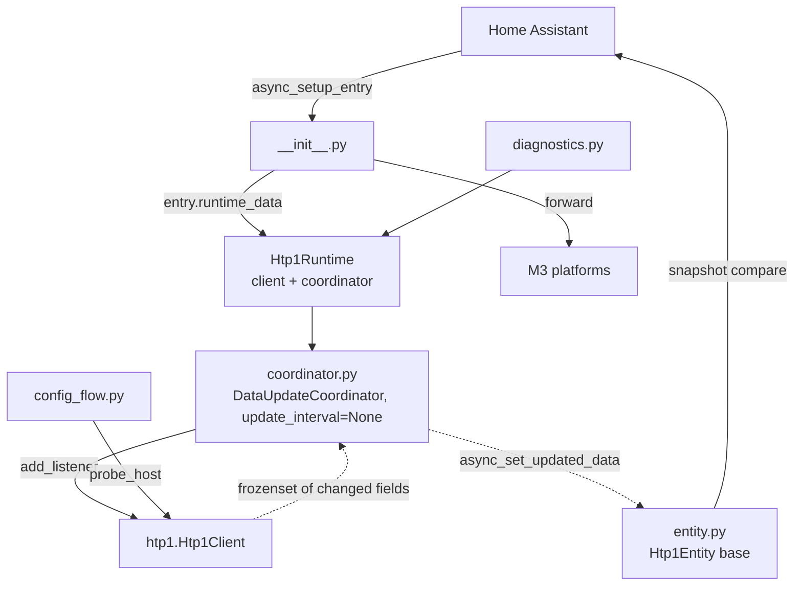

# System Design & Architecture — `integration-core`

## Architecture Overview



**One coordinator per entry, driven by pushes.** `update_interval=None`, fed by
`async_set_updated_data` from the client's change callback. Chosen over a hand-rolled subscriber
registry because `CoordinatorEntity` satisfies `entity-event-setup`, `entity-unavailable` and
`parallel-updates` by inheritance.

## Component Breakdown

| Module | Responsibility |
|---|---|
| `__init__.py` | `async_setup_entry` / `async_unload_entry`, `PLATFORMS`, device registration, the `Htp1ConfigEntry` type alias |
| `const.py` | `DOMAIN`, option keys and defaults, `POWER_OFF_KEEPS_NETWORK` |
| `coordinator.py` | Owns the client. Push handling, availability, once-per-outage logging, and **all command translation** |
| `entity.py` | `Htp1Entity(CoordinatorEntity)` — device info, availability, and the change-gated state write |
| `config_flow.py` | user, reconfigure, options |
| `diagnostics.py` | Redacted dump |
| `strings.json`, `translations/en.json` | Byte-identical, CI-compared |

## Design Decisions

| Decision | Rationale |
|---|---|
| `entry.runtime_data` with a typed alias | The current pattern; `hass.data[DOMAIN][entry.entry_id]` is what it replaced |
| Setup awaits the first document, then raises `ConfigEntryNotReady` on failure | Home Assistant owns setup retry. The client makes **one** attempt and does not start its ladder, so there are never two backoff loops |
| Everything after the client exists is wrapped so a later failure closes it | Home Assistant does **not** call `async_unload_entry` for a setup that raised, and it retries on a backoff — so each failed attempt would otherwise leak a socket to a unit that has a limited number of them |
| `_async_update_data` is implemented even though nothing schedules it | Makes `async_config_entry_first_refresh()` behave normally, and gives `homeassistant.update_entity` a real meaning — which is also the user's escape hatch from a wedged parse budget |
| The device is registered explicitly in setup, before any entity | So a device exists even before M3 adds entities, and so its identity does not depend on an entity being loaded |
| Unique id is the serial, falling back to `host-<host>` | All five units report one. The fallback exists so a unit that otherwise works is never refused |
| **No** DHCP discovery | HW-03 measured no MAC in the document. `registered_devices` needs one to register a device connection, so a self-heal is not buildable and must not be implied |
| Options are read live, and never reload the entry | Reloading drops a healthy socket and blanks every entity to change a number |

## Data Models

```python
type Htp1ConfigEntry = ConfigEntry[Htp1Runtime]


@dataclass
class Htp1Runtime:
    client: Htp1Client
    coordinator: Htp1Coordinator
```

**Config entry data:** `{CONF_HOST: str}`. Nothing else — the unit has no credentials, and its
identity comes from the document.

**Options:**

| Option | Default | Why it exists |
|---|---|---|
| `power_off_action` — `off` \| `sleep` \| `do_nothing` | `off` | A room turning off, or a stray automation, should not be able to take a whole processor down. This is a real per-room decision across five units |
| `max_volume_db` | the unit's `vph` | A ceiling on writes. `volume_level` is still derived from the unit's real range; the ceiling only clamps what we send |

Deliberately **not** options: a poll interval (there is no polling — the README says so, so
nobody adds one) and any "which entities to create" toggle, which is what the entity registry is
for.

## Availability and logging

```
client connection change
  → coordinator: connected=False → async_set_update_error(Htp1ConnectionError(...))
                 first document   → was_down = not last_update_success
                                    async_set_updated_data(mirror)
                                    if was_down: _LOGGER.info("Reconnected to %s", host)
  → CoordinatorEntity.available == coordinator.last_update_success
```

**The "reconnected" line must be emitted by hand.** `async_set_updated_data` does not enter
`_async_refresh`, which is where the coordinator's own recovery logging lives — so without this,
`log-when-unavailable` is only half satisfied. `async_set_update_error` *is* self-throttling: it
logs only when `last_update_success` was True, so calling it on every failed reconnect across a
2→60 s ladder produces one message, not hundreds.

**Unavailable and unknown are different, and the distinction is enforced in review.**
Unavailable means we cannot talk to the unit. Unknown (`None`) means we can, and it has not told
us this value. A field this firmware does not carry reports unknown; it does not report
unavailable, and it never reports a stale value.

**`coordinator.data` is the same mutable mirror object every time.** Identity never changes, so
nothing may compare it against a previous value. Change detection happens at the entity, against
a snapshot tuple.

## Non-Functional Requirements

**Fan-out.** Roughly fifty wall panels receive every state change, so `Htp1Entity` compares a
snapshot tuple — every reported property *plus* `available` — and returns without calling
`async_write_ha_state()` when identical. This is the third of the three change-gating layers;
the other two are in the mirror and the client.

**Shutdown.** `async_unload_entry` awaits `client.async_stop()`, which is idempotent and cancels
every timer. It must never block Home Assistant's shutdown.

**Security.** No credentials exist. The exposure is topology — unit name, input labels, Dirac
slot names, serial — so diagnostics redacts `entry.data`, `entry.options` **and** the mirrored
values that are the owner's words rather than the device's behaviour.
