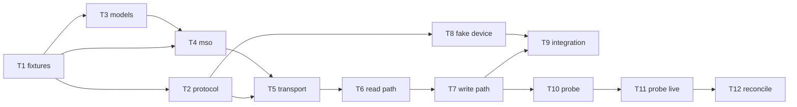

# Project Planning & Task Breakdown — `htp1-client`

Milestone M1: the vendored protocol client under `custom_components/ha_monolith_htp1/htp1/`,
plus the two tools that make it testable and measurable.

Every task is **test-first** (`tdd`). A task is done when its tests pass and `ruff check` /
`ruff format --check` are clean — not when the code is written.

## Milestones

- [x] **M1.A Foundations** — fixtures and the Windows-safe test harness (T1)
- [x] **M1.B Pure layers** — `protocol.py`, `models.py`, `mso.py`, `options.py` (T2–T4)
- [x] **M1.C The client** — transport, read path, write path (T5–T7)
- [x] **M1.D Tools** — fake device, integration tests, probe script (T8–T10)
- [ ] **M1.E Measure** — read-only probe of all five units; close HW-02/03/04/07 (T11)
- [ ] **M1.F Reconcile** — backlog, memory, docs (T12)

## Status — reconciled after T10

| Task | Status | Notes |
|---|---|---|
| T1 fixtures and harness | **done** | Fixtures regenerated rather than ported, at the user's direction — closes R5 by construction |
| T2 `protocol.py` | **done** | 34 tests. Split `MALFORMED` from `UNKNOWN`, which the plan had not called out |
| T3 `models.py` | **done** | A failing test found a floating-point tie defect review had missed |
| T4 `mso.py` + `options.py` | **done** | `options.py` was not a planned module; the design put these functions in `models.py`, but they consume the mirror's collections |
| T5 client: transport | **done** | Two API warts raised at review and fixed before T6 |
| T6 client: read path | **done** | Budget guard demonstrated against a broken build, not assumed |
| T7a client: queue, guard, interlock | **done** | Split as the plan advised rather than landing T7 as one change |
| T7b client: pending overlay, reconcile | **done** | Disproved a design claim about notification; design corrected |
| T8 fake device | **done** | 8 faults; two bugs in the fake itself would have made tests lie |
| T9 integration tests | **done** | Found the missing parse budget in `_read_until_document`, which no in-process fake could have surfaced |
| T10 probe script | **done** | Read-only guard is stricter than planned: the word `allow_writes` may not appear at all |
| T11 probe the five units | **blocked — awaiting go-ahead**, by design | Read-only, but it is live hardware in occupied rooms |
| T12 reconcile | not started | |

**Progress.** 263 tests green in 1.4 s, on Windows, with Home Assistant absent and no device
present. ruff check and format clean. Everything in M1 is done except measuring real hardware
and the closing reconcile: the client is complete, proven against a real socket, and has a
read-only probe that cannot write.

**Scope changes.** Four, none of which altered the milestone's shape:
- `options.py` became its own module. The design put those functions in `models.py`, but they
  consume the mirror's collections.
- T7 was split into T7a and T7b, as this plan advised rather than as a surprise.
- Two an earlier driver faults (`trickle`, `drop-mid-frame`) were dropped from the fake with reasons
  recorded: aiohttp owns framing here, so they would test aiohttp.
- The probe's read-only guard is stricter than specified — the word `allow_writes` may not
  appear in the script at all.

**Defects found by tests rather than by review**, which is the part worth keeping:
- A floating-point tie that returned a volume one dB *louder* than requested (T3).
- A design claim about notification that the overlay made false (T7b).
- A missing parse budget in `_read_until_document`, which no in-process fake could surface (T9).
- Two bugs in the fake device itself, both of which would have made tests pass vacuously (T8).

**Risks.** R5 closed by regeneration plus `test_fixtures_carry_no_site_data`. R6 closed by
splitting T7. R3 closed by verifying aiohttp's pong derivation. R7 held: no test in this
milestone waits on a real timer except the integration tests, deliberately, where aiohttp's own
behaviour is the thing under test. R1, R2 and R8 remain open and are exactly what T11 addresses.

**Next.** T11 — read-only probe of all five units, closing HW-02/03/04/07 before M2 encodes
assumptions about the volume range and the `/eq/tc` type. Then T12.

**Coordination.** T11 needs an explicit go-ahead. Reading is provably passive, but it is live
hardware in an occupied home, so it does not happen on my own initiative.

## Task Breakdown

### Phase 1: Foundation

**T1 — Fixtures and test harness**
- *Outcome:* `tests/conftest.py` plus `tests/fixtures/{mso_modern,mso_legacy,mso_sparse,wire_samples}.json`.
  The conftest detects whether Home Assistant is importable; when it is not, it installs stub
  parent packages so `custom_components.ha_monolith_htp1.htp1.*` imports without executing the
  integration's `__init__.py`, and sets `collect_ignore_glob = ["ha/*"]`.
- *Depends on:* nothing.
- *Evidence:* fixtures load in a smoke test; suite still green on Windows.
- *Scenarios:* all of them — every later task reads these fixtures.
- *Note:* **Written from scratch, not ported.** The earlier driver's `tests/fixtures.lua` has
  invented values too, but regenerating removes the question entirely rather than answering it
  by inspection — R5 is closed by construction. Only the *schema* is reused: path names and
  value domains, which are documented in the design doc and are not site data. Every string is
  invented here, and `test_fixtures_carry_no_site_data` pins that.
  `mso_legacy` must have a slot with the `name` key **absent**, `mso_modern` one with
  `name: ""` — different code paths, and T4 tests both.

### Phase 2: Core Features

**T2 — `protocol.py`** *(pure; no async, no clock)*
- *Outcome:* `parse_message`, `classify_bare`, `encode_get_mso`, `encode_change`,
  `normalise_ops`, verb constants.
- *Depends on:* T1.
- *Evidence:* 10 tests incl. `test_parse_never_raises` over ~40 malformed inputs.
- *Scenarios:* protocol group; AC-06, AC-07, AC-15, AC-16.
- *Risk:* the split-on-first-space rule is easy to "improve" into `split()`. The test with a
  value containing spaces is the guard.

**T3 — `models.py`** *(pure)*
- *Outcome:* `round_half_down`, `db_to_fraction`, `fraction_to_db`, `InputInfo`, `DiracSlot`,
  `Versions`, `BoolCodec` / `OnOffStringCodec`.
- *Depends on:* T1.
- *Evidence:* 9 tests. `test_every_db_survives_a_round_trip` must include **(-127, 0)** — the
  range that exposed Q4 — and `test_the_fraction_is_never_quantised` must fail if anyone
  reintroduces integer-percent rounding.
- *Scenarios:* models group; AC-03, AC-04.
- *Risk:* highest-consequence module in the milestone. A silent error here is audible.

**T4 — `mso.py`** *(pure, stateful mirror)*
- *Outcome:* `MsoMirror`, `TRACKED_PATHS`, `CONTAINER_PREFIXES`, `_interest` classification,
  container re-derivation, six-row `/cal/slots`, `frozenset` change sets.
- *Depends on:* T1, T3.
- *Evidence:* 14 tests, incl. all eight container paths parametrised and
  `test_status_raw_is_never_walked`.
- *Scenarios:* mso group; AC-12, AC-13, AC-14, AC-17.
- *Risk:* largest single unit. Port `state.lua`'s `SCALAR_PATHS` table rather than retyping it.

**T5 — `client.py`: transport**
- *Outcome:* connect with the 15 s timeout, `heartbeat=30.0`, the supervisor task, the jittered
  backoff ladder from a per-client `random.Random(seed)`, and the start/stop contract —
  `wait_for_first_document=True` makes **one** attempt and raises, ladder starts only afterwards.
- *Depends on:* T2, T4. Uses an **injected fake transport and clock**; no socket, no sleeping.
- *Evidence:* AC-01, AC-11; `test_start_makes_one_attempt_and_raises`;
  `test_module_never_calls_random_seed`.
- *Scenarios:* client transport + start/stop groups.

**T6 — `client.py`: read path**
- *Outcome:* frame dispatch, the parse-failure budget of 3, listener registry with unsubscribe,
  notification semantics.
- *Depends on:* T5.
- *Evidence:* AC-09 — including `test_the_error_path_retry_does_not_reset_the_budget`, the
  subtle one — and AC-16.
- *Scenarios:* client read-path group.

**T7 — `client.py`: write path**
- *Outcome:* the 50 ms queue coalesced by path, the already-there guard against
  `optimistic(path)`, the `_pending` overlay, the 2 s reconcile re-armed per flush, the
  read-only interlock, and the four raise-before-sending conditions.
- *Depends on:* T5, T6.
- *Evidence:* AC-02, AC-05, AC-06, AC-08, AC-10, AC-18, AC-20; and
  `test_a_rollback_does_not_clobber_a_newer_push`, which pins the ordering the overlay exists
  for.
- *Scenarios:* client write-path, pending-overlay and write-contract groups.
- *Risk:* the densest task. If it grows past comfortable review size, split the reconcile
  watchdog into its own task rather than rushing it.

### Phase 3: Integration & Polish

**T8 — `tools/fake-htp1.py`**
- *Outcome:* a local server speaking the real protocol from an invented document, applying
  `changemso` and broadcasting `msoupdate` to every client, rejecting any path but
  `/ws/controller`. Faults: **`accept-tcp-no-upgrade`**, `trickle`, `ignore-ping`, `bare-json`,
  `never-confirm`, `container-replace`, `garbage`, `no-videostat`, `no-serial`,
  `drop-mid-frame`.
- *Depends on:* T2 (shares the wire format). Dev-only `websockets` dependency.
- *Evidence:* starts, serves, each fault reachable by flag.

**T9 — Integration tests over a real loopback socket**
- *Outcome:* 10 tests from the testing doc's integration group.
- *Depends on:* T7, T8.
- *Evidence:* `test_the_handshake_timeout_fires_against_accept_tcp_no_upgrade` — the only proof
  of AC-01 against a real socket, and the defect that wedged the earlier driver.

**T10 — `scripts/probe_htp1.py`**
- *Outcome:* `summary` mode (connect, `getmso`, scrubbed digest, disconnect) and `observe` mode
  (hold the socket, print pushes). Raw output opt-in, to gitignored `scripts/output/`.
- *Depends on:* T7.
- *Evidence:* AC-21 `test_the_probe_is_read_only_by_construction` (source-level: never passes
  `allow_writes`, never calls a write method) and `test_the_probe_summary_scrubs_site_data`.

**T11 — Probe the five units, read-only**
- *Outcome:* HW-02 (`/eq/tc` type on both firmwares), HW-03 (MAC present?), HW-04 (real
  `vpl`/`vph` per unit), HW-07 (`/status` vocabulary) answered with live evidence. Plus one
  `observe` run to confirm a front-panel change propagates, and to record whether any unit emits
  a bare-JSON payload (assumption A5).
- *Depends on:* T10.
- *Evidence:* backlog rows closed with observations; **no raw capture committed**.
- *Gate:* **ask before running.** Reading is provably passive — an idle connection sent zero
  bytes over 90 s and the unit serves concurrent connections independently — but it touches live
  hardware, so it gets a deliberate go-ahead. No writes: HW-01 and HW-06 stay in M4.

**T12 — Reconcile**
- *Outcome:* backlog updated with evidence; durable findings to memory scope
  `project:ha-monolith-htp1`; implementation doc filled; `dev-implementation` check (Phase 7).
- *Depends on:* T11.

## Dependencies

**External dependencies:** none at runtime. `aiohttp` ships with Home Assistant; `websockets`
and `pytest` are dev-only. **No `git+https` requirement, ever.**

**Hardware dependency:** T11 only, and read-only. Everything before it runs on a laptop with no
device present — which is the point of T8.

**Parallelisable:** T2/T3 after T1; T8 can proceed alongside T5–T7 since it only shares the wire
format.

## Timeline & Estimates

No target dates — this is one person working in sessions, and invented dates would be
fiction. Relative sizing only:

| Size | Tasks |
|---|---|
| S | T1, T2, T8, T10, T12 |
| M | T3, T5, T6, T9, T11 |
| L | T4, T7 |

T4 and T7 carry most of the milestone's risk and should not be attempted at the end of a long
session. Natural stopping points are after T4 (all pure layers done) and after T9 (client
proven against a real socket).

## Risks & Mitigation

| # | Risk | Mitigation |
|---|---|---|
| R1 | `/eq/tc` may be a string, not a bool (HW-02) | Declared `BoolCodec` with a **warn-once** mismatch check; T11 measures it before M2 builds the switch |
| R2 | Bare-JSON payloads (A5) are inherited from another project and unobserved by us | Tolerate the shape regardless — it costs nothing. T11's observe run records whether it is real; the comment stays honest either way |
| R3 | ~~`aiohttp` heartbeat/pong semantics assumed~~ | **Closed.** Verified in aiohttp 3.14.3: `client_ws.py:93`, `self._pong_heartbeat = heartbeat / 2.0`. `heartbeat=30.0` → 15 s pong deadline as designed |
| R4 | Dev box runs Python 3.14.5, CI runs 3.13 | ruff `target-version = "py313"`; CI is the authority. Avoid 3.14-only syntax |
| R5 | Fixtures ported from a real device's document shape could carry site data | Re-verify each fixture before commit; the originals are already invented, but check rather than trust |
| R6 | T7 is dense enough to invite a rushed review | Split the reconcile watchdog out rather than compressing it |
| R7 | Timing tests that use real sleeps become flaky and slow | Inject the clock. No test in this milestone may call `asyncio.sleep` to wait for a timer |
| R8 | Probing live hardware during T11 | Read-only by construction (AC-21), plus an explicit go-ahead before the run. HW-01/HW-06 need writes and are deferred to M4 on the lab unit |

## Resources Needed

- **Tools:** Python 3.13+, `ruff`, `pytest`, `pytest-asyncio`, `websockets` (dev-only), `gh`.
- **Knowledge:** the earlier driver's `state.lua`, `session.lua`, `mapping.lua` and its design
  doc — port these rather than re-deriving. `jsoosiah/htp1-custom-controller` for MSO paths.
- **Infrastructure:** none. No device is required until T11, and no Home Assistant instance is
  required in this milestone at all.
- **Access:** network reachability to the five units for T11 only.

## Test Scenario Coverage

Every group in the testing doc maps to at least one task:

| Testing doc group | Task |
|---|---|
| `protocol.py` (10) | T2 |
| `models.py` (9) | T3 |
| `mso.py` (14) | T4 |
| `client.py` transport + start/stop (8) | T5 |
| `client.py` read path (5) | T6 |
| `client.py` write path, pending overlay, write contract (16) | T7 |
| Probe safety (2) | T10 |
| Package hygiene (2) | T2–T7 (asserted once the package exists) |
| Integration, fake device (10) | T8, T9 |
| Performance (2) | T4, T7 |
| End-to-end, real units (5) | T11 |

**Uncovered scenarios: none.**
